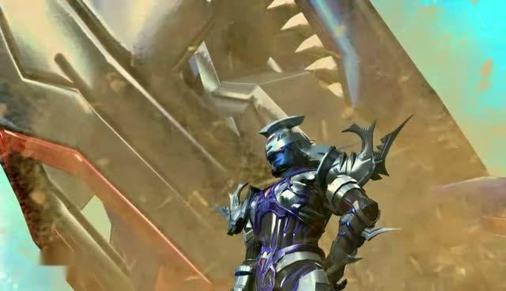
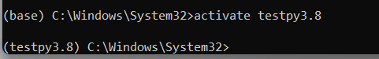

# 鲸鲨王的自我介绍



***鲸鲨王***
*是国产动画片《超兽武装之仁者无敌》中的角色，冥界四大护法之一（排名第三），第三平行宇宙的霸主。*

***
## 基础档案
|    中文名	     |  鲸鲨王  |  配音  |  高全胜  |
| --------   | -----:  | :----:  | -----:  |
| 年龄     | 至少十万岁(已故) |   超兽     |   鲸鲨兽-鲸鲨战神|

### 外貌特征
战斗形态下，他身披银蓝相间的金属铠甲，铠甲线条刚硬且带有尖刺状设计，充满攻击性。头部有尖锐突起，眼部闪烁红光，给人冷酷凶狠的感觉。
<br/>
非战斗形态时，他皮肤呈深蓝色，黑色的头发根根竖起，眼神锐利，肩部铠甲宽大且造型独特，胸口有红色菱形装饰，整体造型霸气威严 。

+ 特征1：皮肤呈深蓝色
+ 特征2：眼神凶狠

## 好朋友
1. 狮王 
2. 夜凌云
3. 蝎子王（龙萤）
4. ~~（曾经） 泰雷~~
### 重要坐标
[住址](https://baike.sogou.com/v52438970.htm)
### 日常作息表
无信息
| 时间        | 事件   |  花费  |
| --------   | -----:  | :----:  |
|  无   | 无 |   无     |

### 人生信条
>强者统治弱者，这是永恒的法则。

***
## 我的专业是人工智能
## 我最喜欢的代码
```Python
import numpy as np
print(np.array([1,2,3])**2)
```
其中执行`print(np.array([1,2,3])**2)`这段代码后，会输出 [1 4 9]，即数组 [1,2,3] 中每个元素平方后的结果组成的新数组。
我最喜欢的环境管理工具是conda


IDE上使用虚拟环境


