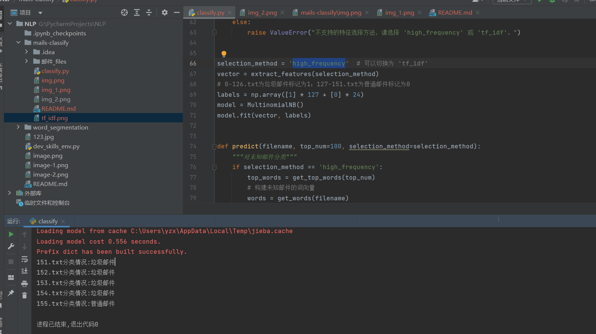

# 代码核心功能说明

## 算法基础

多项式朴素贝叶斯分类器
本代码使用了多项式朴素贝叶斯分类器（Multinomial Naive Bayes）来进行邮件分类。它是基于贝叶斯定理和特征条件独立假设的分类算法。
贝叶斯定理多项式朴素贝叶斯分类器基于贝叶斯定理，其基本公式为：
$$P(y|x) = \frac{P(x|y) \cdot P(y)}{P(x)}$$
其中：

+ $P(y|x)$是后验概率，表示在已知邮件内容为 x 的情况下，邮件属于类别 y 的概率。比如已知一封邮件中包含某些特定词汇 x ，判断它是垃圾邮件（y
  为垃圾邮件类别）的概率。
+ $P(x|y)$是似然概率，即已知邮件属于类别 y 时，出现邮件内容 x 的概率。例如已知一封邮件是垃圾邮件 y ，那么出现 “优惠”“抽奖”
  等词汇组合（x）的概率。
+ $P(y)$是先验概率，它是在没有任何关于邮件内容 x 的信息时，邮件属于类别 y 的概率。比如在所有邮件中，垃圾邮件 y 所占的比例。
+ $P(x)$是边际概率，是邮件内容为 x 的概率，不考虑邮件的类别。
+

在邮件分类问题中，我们的目标是通过计算不同类别 y 的$P(y|x)$，比较它们的大小，从而确定邮件最有可能属于的类别。即对于给定的邮件内容
x，计算所有可能类别 y 的后验概率 $P(y|x)$，选择 $P(y|x)$ 最大的那个类别作为邮件的分类结果。
特征独立性假设
在多项式朴素贝叶斯中，假设每个特征（即每个单词）在给定类别下是相互独立的。也就是说，一个邮件中某个单词的出现与否，不会影响其他单词的出现概率。例如，在判断一封邮件是否为垃圾邮件时，“优惠”
这个词的出现与 “抽奖” 这个词的出现是相互独立的事件。

## 数据处理流程

分词处理

这行代码将每一行文本分割成一个个单词。

## 停用词过滤

通过正则表达式过滤了无效字符，并过滤了长度为 1 的词。

这样可以去除一些没有实际意义的字符和单字，减少噪声。

## 特征构建过程

### 高频词特征选择

高频词特征选择是基于词频的方法。对于每一封邮件，统计每个高频词在邮件中出现的次数，将这些次数作为特征向量。

#### 数学表达形式

假设我们有一个邮件集合D，其中包含n封邮件。对于每一封邮件$d_i（(i = 1, 2, \cdots, n)）$
，我们选择k个高频词作为特征。对于第i封邮件$d_i$，其特征向量表示为$X_i=(x_{i1}, x_{i2}, \cdots, x_{ik})$。其中，$x_{ij}$
表示第j个高频词在第i封邮件$d_i$中出现的次数，用数学公式表示为：
$$X_i=\begin{pmatrix}x_{i1}\\x_{i2}\\\vdots\\x_{ik}\end{pmatrix}  (i = 1,2,\cdots,n)，(j = 1,2,\cdots,k)$$。

### TF-IDF 特征加权

TF-IDF（Term Frequency - Inverse Document Frequency）是一种用于信息检索与文本挖掘的常用加权技术。TF-IDF
值由两部分组成：词频（TF）和逆文档频率（IDF）。

#### 数学表达形式

词频（TF）表示某个词w在一篇文档d中出现的频率。计算公式为：
$$TF(w, d)=\frac{count(w, d)}{\sum_{w' \in d}count(w', d)}$$
其中，$count(w, d)$表示词w在文档d中出现的次数，$\sum_{w' \in d}count(w', d)$表示文档d中所有词出现的次数之和。

逆文档频率（IDF）表示某个词w在整个文档集合D中的普遍重要性。计算公式为：
$$IDF(w)=\log\frac{|D|}{|\{d \in D: w \in d\}|}$$
其中，$|D|$表示文档集合D中的文档总数，$|\{d \in D: w \in d\}|$表示包含词w的文档数。

TF-IDF 值：
一个词w在文档d中的 TF-IDF 值是词频（TF）和逆文档频率（IDF）的乘积，即：
$$TF - IDF(w,d)=TF(w,d)\times IDF(w)$$

#### 两种方法的差异

高频词特征选择只考虑了词在文档中的出现次数，而没有考虑词在整个文档集合中的普遍重要性。因此，一些常见的词（如 “的”、“是”
等）可能会在特征向量中占据较大的比重，影响分类效果。

TF-IDF 特征加权则综合考虑了词在文档中的出现频率和在整个文档集合中的普遍重要性。通过 IDF 的加权，能够降低常见词的影响，提高分类的准确性。

## 两种特征模式的切换方法

切换单引号中的字符进行两种特征模式的切换。

## 运行截图

### 高词频模式运行截图

### TF-IDF模式运行截图

### 任务四运行截图

### 任务五运行截图

